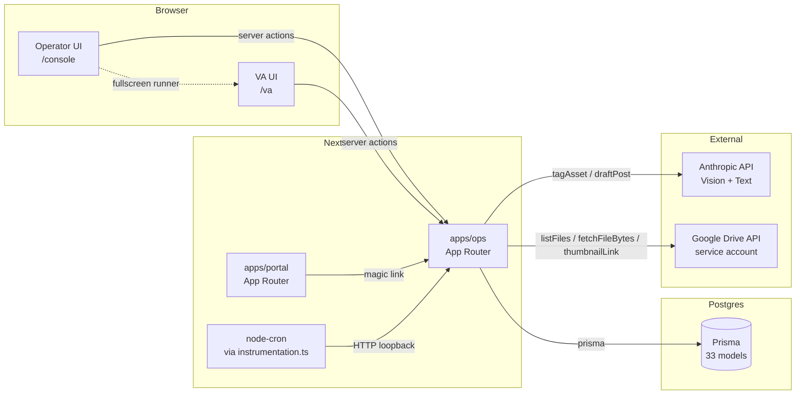

# XCRM Functionality Audit

_Audit performed 2026-04-23 against branch `claude/build-crm-system-zo5AT`._

This document is a map, not a roadmap. Section 8 names problems but does not prescribe fixes.

---

## 1. System Overview

XCRM is an autonomous social-media operations system for an agency that runs many X (Twitter) accounts on behalf of multiple "models" (talent). An operator (founder/partner) onboards a model once, connects a Google Drive folder of content, and the system handles the rest: ingest content with auto-tags, generate post drafts on a 4-hour cron, route by confidence into either a review queue or a scheduled-to-execute state, group accounts into "camps" so a shared asset doesn't fire across them within 72h, and feed every approved post to a VA who executes the post on a real phone via a fullscreen keyboard-driven runner. Posted content's engagement (likes/reposts/replies/etc.) gets ingested back into the system so the generator's per-account peak hours and aesthetic preferences self-tune. The product principle is **autonomous-by-default**: the operator logs in 3-4×/week for 10 minutes to handle exceptions, not to drive the work.

### Tech stack
- **Framework**: Next.js 14 App Router (two apps: `apps/ops` for the operator/VA console, `apps/portal` for agency-facing portal — portal is mostly stubbed in Phase 0).
- **Language/runtime**: TypeScript 5.5, Node 20.19, pnpm workspaces + Turborepo monorepo.
- **DB**: PostgreSQL via Prisma 5.18.0 (`packages/db`). Migrations are hand-written using `prisma migrate diff`; partial unique indexes are emitted via raw SQL.
- **Auth**: NextAuth (credentials provider for ops, magic-link for portal). `requireUser()` helper at `apps/ops/src/lib/session.ts`.
- **Hosting**: Railway (Dockerfile-based — `apps/ops/Dockerfile`). Single ops service; portal + worker services were planned but worker is retired (see "Off-spec carryovers" in `/docs/operational-model.md`).
- **Background jobs**: in-process `node-cron` registered via Next.js `instrumentation.ts`. BullMQ + Redis was the original plan (`packages/jobs/`); intentionally retained but unused.
- **Key dependencies**: `@anthropic-ai/sdk` (Claude), `googleapis` + `google-auth-library` (Drive), `sharp` 0.33 + `heic-convert` 2.1 (image conversion for HEIC/HEIF previews), `node-cron`, `bcryptjs`, `zod`.
- **Third-party APIs in use**: Anthropic (vision tagging + draft generation), Google Drive (asset ingest via service account). X/Twitter API is **not** integrated — the VA does the post on a real phone manually.

### High-level architecture

---

## 2. Data Model

Schema lives at `packages/db/prisma/schema.prisma`. Migrations under `packages/db/prisma/migrations/`.

### Migration history
| Date | Migration | Changes |
| --- | --- | --- |
| 2026-04-19 | `20260419000000_init` | Initial schema: 33 models, 27 enums |
| 2026-04-21 | `20260421000000_feature_2_drive_ingest` | `DriveSource`, `DriveSync`, `AssetAuditEvent`; `ContentAsset` Drive fields |
| 2026-04-21 | `20260421010000_build_a_onboarding` | `Model.onboardingCompletedAt` |
| 2026-04-22 | `20260422010000_soft_delete_partial_uniques` | Partial unique indexes (`WHERE deletedAt IS NULL`) on User.email, AgencyUser.email, Agency.slug, Account.handle, Account.platformAccountId, Post.platformPostId; `DriveSource` switches from `isActive`+`deletedAt` to `status` enum |

### Models — summary table

| Model | Soft-delete? | Actively used? | Purpose |
|---|---|---|---|
| **User** | ✅ | yes | Ops users (FOUNDER/PARTNER/VA_T1-3) |
| **Session** | — | implicit (NextAuth) | Ops session tokens |
| **AgencyUser** | ✅ | yes (portal login) | Portal users |
| **AgencyMagicLink** | — | yes | Magic-link auth for portal |
| **AgencySession** | — | yes | Portal sessions |
| **Agency** | ✅ | yes | Customer org |
| **Contract** | — | **no current code** | Tier/slots/rate per agency |
| **Model** | ✅ | yes | Talent profile (display/real name, archetype, voice, rules) |
| **Account** | ✅ | yes | X handle, status FSM, peak hours, phone device |
| **PhoneDevice** | — | yes | Shared device labels |
| **AccountFollowerSnapshot** | — | **no current code** | Time-series follower counts |
| **StatusTransition** | — | yes (account) | Account-status audit |
| **ContentAsset** | ✅ | yes | Photo/Video/GIF; auto+manual tags; Drive linkage |
| **AssetUsage** | — | **partially used** (read for "hide-posted"; not written yet) | Asset ↔ Post bridge |
| **DriveSource** | n/a (status enum) | yes | Connected Google Drive folder |
| **DriveSync** | — | yes | Per-poll-run log |
| **AssetAuditEvent** | — | yes (delete/restore/manual-tag) | Asset audit |
| **ContentFormula** | — | **no current code** | Versioned content playbook |
| **InsightRule** | — | **no current code** | Data-driven rule engine |
| **Post** | ✅ | yes | Tweet — draft → POSTED |
| **Reply** | ✅ | **no current code** | Reply — schema only |
| **Repost** | — | **no current code** | Coordinated repost — schema only |
| **PostEngagement** | — | yes (Build G) | Snapshot metrics per post |
| **ReplyEngagement** | — | **no current code** | Reply metrics |
| **RepostEngagement** | — | **no current code** | Repost metrics |
| **Camp** | — | yes (Build H) | Weekly account grouping |
| **CampMembership** | — | yes | Account ↔ Camp |
| **CampPairingHistory** | — | **no current code** | Avoid pairing repetition (algorithmic camps not built) |
| **ContextNote** | — (status enum) | yes (Build C) | Operator steering note |
| **TaskBatch** | — | yes (Build F) | VA's open work container |
| **Task** | — | yes (Build F) | One VA action |
| **QualitySample** | — | **no current code** | QA review of completed task |
| **JobRun** | — | **no current code** | Job execution log (was for BullMQ worker) |

### Tables that are unused or schema-only today
- **Contract** — no callsite reads or writes. Agency tiering is a Phase 2+ concern.
- **AccountFollowerSnapshot** — meant for follower-count time series; nothing writes it.
- **ContentFormula**, **InsightRule** — large "rules engine" scaffolding from the original spec; the generation loop ignores them and uses prompt-only conditioning.
- **Reply**, **Repost**, **ReplyEngagement**, **RepostEngagement** — only POST tasks ship today; replies/reposts are deferred features.
- **CampPairingHistory** — algorithmic camp proposals were anti-goals for Build H.
- **QualitySample** — VA QA-review flow is a Phase 2+ concern.
- **JobRun** — original BullMQ worker telemetry; the worker package (`packages/jobs/`) is intentionally retained but unused.

### Soft-delete coverage
Soft-deletable: `User`, `AgencyUser`, `Agency`, `Model`, `Account`, `ContentAsset`, `Post`, `Reply` (schema only).
Not soft-deletable by design: every audit/log table; `DriveSource` (uses `status: ACTIVE | DISCONNECTED` to make reconnect a row-level state transition); `Camp` (lifecycle is `PROPOSED → ACTIVE → COMPLETED`); `ContextNote` (lifecycle is `ACTIVE → EXPIRED | CANCELLED`).

### Apparent UI/schema mismatches
None found in the actively-used surfaces. Field-level reference scan against the operator console returned no mismatches: every `account.X`, `model.X`, `asset.X`, `post.X` access maps to a schema field or relation.

### Missing fields the UI implies but the schema doesn't define
- `Account.timezone` — Build D's scheduler comments call out that timezones are deferred to Build G; today scheduling is UTC-only. The `Account` row has no `timezone` column.
- `Model.avatarUrl` — the `<PostPreview>` tweet card renders an "initial" circle because there's no avatar URL on `Model`.
- No "uploaded from portal" path for `ContentAsset.uploadedByAgencyUserId` even though the column exists — only Drive ingest writes ContentAssets.

---

## 3. User Roles & Permissions

### Role enum (`UserRole` in schema)
- `FOUNDER`, `PARTNER`, `VA_T1`, `VA_T2`, `VA_T3`

### Auth flows
- **Ops** (`apps/ops/src/auth.ts`): credentials provider (email/password, bcrypt-hashed `User.passwordHash`). Session shape includes `role`. NextAuth route at `/api/auth/[...nextauth]`.
- **Portal** (`apps/portal/src/app/login/page.tsx`): magic link. Server action creates an `AgencyMagicLink` (sha256-hashed token), the `/api/auth/consume` route validates and creates an `AgencySession`. Token-send is stubbed (no Resend wiring).

### Role gates (where they live)
- **`apps/ops/src/app/console/layout.tsx`** — redirects `role !== 'FOUNDER' && role !== 'PARTNER'` to `/login`.
- **`apps/ops/src/app/va/layout.tsx`** — admits VA tiers AND FOUNDER/PARTNER (operators can "switch hats" per `/docs/operational-model.md`).
- **API routes** under `/api/drive/file/[id]`, `/api/drive/sync/[id]`, `/api/generate/[accountId]` — explicit `role !== 'FOUNDER' && role !== 'PARTNER'` returns 403.
- **Cron API routes** (`/api/drive/sync/cron`, `/api/context-notes/expire`, `/api/generate/cron`, `/api/engagement/recompute-peak-hours/cron`, `/api/engagement/ingest`) — `x-cron-secret` header check against `CRON_SECRET` env var.

### What the spec says vs. the code
The doc names two **modes** (Operator and VA) and treats role tiers as nuance. In code there's no granular permission gate beyond the FOUNDER/PARTNER binary on console actions: a `PARTNER` and a `FOUNDER` have identical write power. VA tiers (`VA_T1/T2/T3`) are also identical to each other in code; tier appears nowhere in routing or actions.

### Server actions
Every `'use server'` action begins with `await requireUser()`, which redirects to `/login` if no session. There is **no** check that the role is FOUNDER/PARTNER inside the action — the layout's redirect is the only gate. A VA with a forged session cookie reaching `/console/accounts/actions.ts` would pass all server-side checks. (See §8 for caveats.)

---

## 4. Feature Inventory

Grouped by domain, mapped to the build sequence A-H from `/docs/operational-model.md`.

### 4.1 Onboarding (Build A — done)
- **What it does.** A 5-step wizard that takes an operator from "no agency yet" to "model with Drive folder connected and accounts attached" in under 10 minutes. Save-and-resume: each step persists to DB before the next is shown; abandoned wizards surface as a yellow signal on the roster.
- **Where.** `apps/ops/src/app/console/onboard/` (`page.tsx`, `actions.ts`, `_components/step-1-agency.tsx`…`step-5-review.tsx`, `_components/stepper.tsx`, `_lib/resume.ts`).
- **How.** URL-driven state (`?modelId=…&step=N`); each `submitStepN` server action validates with zod, writes the relevant rows, redirects to next step. Step 4 calls `runDriveSync` inline to kick off initial ingest. `Model.onboardingCompletedAt` flips on step 5.
- **State.** Working.
- **Dependencies.** Build A is foundational; downstream surfaces filter on `onboardingCompletedAt IS NOT NULL`.

### 4.2 Roster + Model detail (Build B — done)
- **What it does.** `/console` is a single-row-per-model roster with signal-light pills (runway / escalated / failed syncs / quarantined / incomplete-onboarding / review queue). `/console/models/[id]` is one URL with anchor-navigable blocks (Overview / Content / Scheduled / Notes / Settings / Audit) and a sticky left rail using IntersectionObserver for active-section highlighting.
- **Where.** `apps/ops/src/app/console/page.tsx`; `_loaders/roster.ts`; `_components/{signal-light,roster-row,active-notes-strip}.tsx`; `models/[id]/page.tsx`; `models/[id]/_components/{anchor-nav,section-block,...}.tsx`; `lib/signal-lights.ts` (pure logic + 25 tests).
- **How.** `getRosterModels()` issues one `model.findMany` with strategic includes, then a separate query for sync-failure tail across all sources, and one `post.groupBy` for per-account scheduled + pending counts. Severity sorted red → yellow → green, alphabetical within (worst-signal-wins).
- **State.** Working. Every signal except "Escalated" was unstubbed at chunk 3 of B; "Escalated" was unstubbed in Build F's chunk 3.
- **Dependencies.** Reads everything (Account, Model, DriveSource, DriveSync, Post, Task).

### 4.3 Context notes (Build C — done)
- **What it does.** Hotkey `N` (registered in console layout) opens a modal where the operator types a note (title + body), picks scope (`ALL` / `ARCHETYPES` / `ACCOUNTS` by @handle), weight 1-10, duration (today / 3d / 1w / until removed). Notes show on the roster header strip ("3 notes active — click to expand") and on each affected model's `#notes` block. Notes auto-expire on a `*/10 * * * *` cron.
- **Where.** `apps/ops/src/app/console/context-notes/actions.ts`; `_components/{note-hotkey,note-overlay,note-list-item,active-notes-strip}.tsx`; `_loaders/active-notes.ts`; `lib/context-notes.ts` (scope union + resolver, 19 tests); `app/api/context-notes/expire/route.ts`.
- **How.** Scope is a discriminated union stored in `ContextNote.scope` (Json column). `noteAppliesTo(scope, {archetype, accountIds})` resolves it. `parseScope()` falls back to `ALL` on malformed JSON.
- **State.** Working. Cmd+K palette explicitly deferred per spec.
- **Dependencies.** Reads `Account.handle` to resolve operator-typed @handles.

### 4.4 Drive ingest (Feature 2 — done)
- **What it does.** Connect a Drive folder; service account (auth via `GOOGLE_SERVICE_ACCOUNT_JSON` env, plain JSON or base64) lists files, ingests new ones into `ContentAsset`, deduplicates via `(driveSourceId, driveFileId)` unique. Tagging fires fire-and-forget per asset. Disconnect flips status to `DISCONNECTED`; reconnect reactivates the same row.
- **Where.** `apps/ops/src/lib/drive-sync.ts` (orchestrator, 60s timeout on ingest); `lib/asset-tagger.ts`; `app/api/drive/sync/[id]/route.ts` (manual trigger); `app/api/drive/sync/cron/route.ts` (fan-out); `app/console/drive-sources/actions.ts` (connect/disconnect + the `upsertDriveSource` helper that handles reconnect); `packages/drive-adapter/` (`auth.ts`, `list-folder.ts`, `fetch-file.ts`, `fetch-thumbnail.ts`).
- **How.** Cron tick → fan-out → per-source: list folder via `cursor`, upsert each file (md5-checksum-aware), enqueue tagging for new/changed, finalize `DriveSync` row. The asset-detail proxy at `/api/drive/file/[id]` streams bytes through the service-account JWT (browsers can't render Drive URLs directly), with a three-tier image-decode ladder for HEIC/HEIF: sharp → heic-convert (WASM) → Drive's pre-generated JPEG thumbnail.
- **State.** Working with the three-tier fallback. iPhone HEIC photos now render and auto-tag correctly.
- **Dependencies.** `packages/ai` for tagging (Anthropic Vision); `packages/drive-adapter` for Drive auth.

### 4.5 Content intelligence — vision tagging (off-spec carryover, formally adopted by D)
- **What it does.** Each ingested ContentAsset gets a vision-v2 schema from Claude: `setting`, `outfit`, `pose`, `aesthetic`, `nsfwRating`, `mood`, `lighting`, `colorPalette`, `dominantSubject`, `composition`, `textInImage`, `faceCount`, `caption`. The `caption` field is the retrieval backbone for generation.
- **Where.** `packages/shared/src/prompts/asset-tagging.ts`; `packages/ai/src/{tag-asset,types}.ts`; `apps/ops/src/lib/asset-tagger.ts`. Tests at `packages/ai/src/tag-asset.test.ts` (8 tests).
- **State.** Working. Asset-detail page surfaces all fields.

### 4.6 Generation loop (Build D — done)
- **What it does.** Every 4h (or on-demand via "Generate draft" button on model detail) the orchestrator iterates active accounts, builds a candidate-asset pool (top-30 by novelty, excluding posts already committed and camp-mate-blocked assets), pulls in-scope context notes, summarises engagement insights, calls Claude with a structured prompt, parses `{copy, assetId, confidence, reasoning}`, picks `scheduledFor` via the deterministic scheduler, and routes by confidence: `FRESH_BUILD` always reviews, `ACTIVE_RAMPING` <0.8, `ACTIVE_ESTABLISHED` <0.7, `ACTIVE_MATURE` <0.6 → PENDING_APPROVAL; else SCHEDULED.
- **Where.** `apps/ops/src/services/generate-draft.ts` (orchestrator); `app/api/generate/cron/route.ts` (cron); `app/api/generate/[accountId]/route.ts` (manual); `app/console/_loaders/{candidate-assets,scheduled-posts}.ts`; `lib/{post-scheduler,confidence-routing}.ts` (pure logic + 19 tests); `packages/shared/src/prompts/draft-post.ts`; `packages/ai/src/draft-post.ts` (8 tests); `app/console/models/[id]/_components/generate-draft-button.tsx`.
- **How.** The scheduler is **pure** — no LLM call. It walks hour-by-hour from the next full hour, picks the first peak-hour slot ≥3h spacing from existing scheduled posts, within 72h. Generation cron is gated by both `DRIVE_SYNC_SCHEDULE_ENABLED=true` (cron-runner gate) and `GENERATE_ENABLED=true` (Anthropic-spend kill switch); manual button bypasses the second.
- **State.** Working. Auto-tagging + manual generation tested live.
- **Dependencies.** Build C (notes), Build G's engagement summary (optional), `packages/ai`.

### 4.7 Review queue (Build E — done)
- **What it does.** `/console/review` lists `PENDING_APPROVAL` posts FIFO, cap 100, no per-model filter. Each card has Approve / Edit & Approve / Reject. Edit form lets the operator change copy + swap assets via top-6 alternatives or paste-an-ID escape hatch.
- **Where.** `apps/ops/src/app/console/review/page.tsx`; `_components/{review-item,edit-form,reject-form}.tsx`; `actions.ts` (3 actions, 11 tests); `_loaders/{review-queue,asset-alternatives}.ts`.
- **How.** Approve flips status to SCHEDULED, records `generationMeta.approval`. Reject → CANCELLED with reason in `generationMeta.rejection` (Build G reads this as a negative signal). Edit-and-approve writes the original copy/assetId into `generationMeta.edit` so the loop sees what the operator changed.
- **State.** Working.
- **Dependencies.** Build D writes the rows.

### 4.8 VA checklist runner (Build F — done)
- **What it does.** `/va` lands on either "resume open batch" or "pick up batch". Pick-up creates a `TaskBatch` (kind = `POST_DROP`, assigned to the VA) of up to 10 SCHEDULED posts due in the next 24h, grouped by `phoneDeviceId` (device affinity). `/va/batch/[id]` is a `fixed inset-0` fullscreen overlay, one task at a time, keyboard-driven: D = done, E = escalate, S = skip, J/K = nav, Esc = exit. Done flips Post → POSTED + Task → COMPLETED. Escalate flips Post back to PENDING_APPROVAL with `generationMeta.escalation`. Skip leaves Post on SCHEDULED for re-pickup.
- **Where.** `apps/ops/src/app/va/{page,layout}.tsx`; `va/batch/{page,[id]/page}.tsx`; `va/_components/{task-runner,escalate-form}.tsx`; `va/actions.ts` (4 actions, 10 tests); `va/_loaders/{current-batch,batch-detail}.ts`; `lib/va-queue.ts` (composeBatch pure logic + 7 tests).
- **State.** Working. POST tasks only — replies/reposts/warmups deferred.
- **Dependencies.** Build E feeds SCHEDULED rows.

### 4.9 Engagement ingest (Build G — done, manual-only)
- **What it does.** `/console/engagement` lists POSTED posts whose latest snapshot is missing or >6h old. Operator types likes/reposts/replies/bookmarks/impressions/profile-clicks; submission inserts a fresh `PostEngagement` row. Aggregation lib computes per-account peak hours + top-performing aesthetics/moods/lightings. A `*/30 * * * *` cron writes back `Account.peakHours` for accounts with ≥5 samples in the last 30 days. Generator prompt now renders an "Engagement insights" block.
- **Where.** `apps/ops/src/app/console/engagement/{page,actions}.ts`; `_components/engagement-form.tsx`; `app/api/engagement/{ingest,recompute-peak-hours/cron}/route.ts`; `services/recompute-peak-hours.ts`; `lib/engagement-aggregation.ts` (15 tests); `_loaders/{engagement-pending,engagement-samples}.ts`. Generator integration in `services/generate-draft.ts` + `packages/shared/src/prompts/draft-post.ts`.
- **State.** Working with manual entry. **No X-API or scraping integration** — `/api/engagement/ingest` is the seam for a future ingestor; same path the manual UI hits.

### 4.10 Camps (Build H — done)
- **What it does.** `/console/camps` lists camps; `/console/camps/new` creates a PROPOSED camp `weekOf=<date>`; `/console/camps/[id]` adds members by @handle, activates, completes. Active camps make the candidate-asset loader exclude any asset a camp-mate already has scheduled or posted within ±72h.
- **Where.** `apps/ops/src/app/console/camps/{page,new,actions,[id]/page,_components/*}.tsx`; `_loaders/{camps,camp-mate-blocks}.ts`; `lib/camp-spacing.ts` (8 tests). Generator integration in `_loaders/candidate-assets.ts`.
- **State.** Working. Algorithmic camp proposals + Repost flow are explicit anti-goals.
- **Dependencies.** Build D's candidate-asset predicate.

### 4.11 Stub surfaces (placeholder pages still in nav)
| URL | File | Stub copy |
|---|---|---|
| `/console/formula` | `apps/ops/src/app/console/formula/page.tsx` | "No formula versions yet" |
| `/console/insights` | `apps/ops/src/app/console/insights/page.tsx` | "No candidates tonight" |
| `/console/settings` | `apps/ops/src/app/console/settings/page.tsx` | placeholder |
| `/console/vas` | `apps/ops/src/app/console/vas/page.tsx` | placeholder |
| `/va/escalations` | `apps/ops/src/app/va/escalations/page.tsx` | "No open escalations" |
| `/va/stats` | `apps/ops/src/app/va/stats/page.tsx` | StatCards with `—` |
| `/(portal)/{overview,accounts,billing,insights,library,requests,settings}` | various | StatCards / EmptyStates |

`/style` exists as a design-system reference page.

### 4.12 Phase-0 CRUD list pages (kept around as debug surfaces)
`/console/{agencies,models,accounts,devices,content,content/[id]}` plus their `/new` and `/[id]` variants are the original Feature-1 CRUD pages. The roster + model detail are the canonical operator surfaces; these list pages stay for debugging and bulk operations. Tracked as a follow-up `nav-shrink` build in `/docs/reality-delta.md`.

---

## 5. Workflows & User Journeys

### 5.1 Onboard a new model end-to-end
1. Operator hits `/console/onboard` → `/console/onboard?step=1` → picks/creates Agency.
2. Step 2 — Model basics (display name, archetype, voice/tone, hard rules).
3. Step 3 — Adds 1+ Accounts with phone-device assignment.
4. Step 4 — Pastes Drive folder URL or ID → `submitStep4` calls `runDriveSync(sourceId)` synchronously (≤60s). Auto-tagging fires fire-and-forget for each asset.
5. Step 5 — Review & activate → `Model.onboardingCompletedAt = now()`. Operator lands on `/console/models/[id]`.
6. Within minutes, ContentAssets appear with auto-tags (vision-v2 schema). The "Resume onboarding" yellow pill on the roster disappears.

**Friction.** Drive folder must be shared with the service-account email *before* step 4 — failure mode is a yellow signal on the roster after the fact, not in-flow validation. `/docs/infra/scheduled-jobs.md` documents the gotcha.

### 5.2 Generate a draft
1. Cron tick (every 4h) hits `/api/generate/cron`. Gated by `GENERATE_ENABLED=true`. Iterates eligible accounts.
2. Per account: `generateDraftForAccount(accountId)` loads model + account state + active context notes + candidate assets (top-30 by novelty, excluding camp-mate-blocked + already-committed) + engagement summary (top facets + peak hours from PostEngagement).
3. Pure scheduler picks `scheduledFor`. If no slot → return `NO_SLOT`, no Anthropic call.
4. Claude returns `{copy, assetId, confidence, reasoning}`. Pool-membership guard checks assetId is in the pool.
5. `routePostStatus(account.status, confidence)` decides PENDING_APPROVAL or SCHEDULED.
6. `Post` row written with full `generationMeta` ({reasoning, generatedAt, source, poolSize, activeNoteTitles}).
7. Operator can also click "Generate draft" on the model detail to trigger `/api/generate/[accountId]` manually; this bypasses `GENERATE_ENABLED`.

**Manual handoff.** No retry-on-failure loop today — if Anthropic returns garbage JSON, the orchestrator returns `LLM_ERROR` and moves on.

### 5.3 Operator approves a draft
1. Roster's "Review queue: N pending →" link surfaces when ≥1 PENDING_APPROVAL post exists.
2. `/console/review` lists them FIFO. Each item has the X-style `<PostPreview>` + reasoning + hard-rules reminder + Approve/Edit/Reject.
3. Approve → SCHEDULED, `generationMeta.approval` recorded. Edit & approve → also SCHEDULED but with `generationMeta.edit` capturing originals. Reject → CANCELLED, `generationMeta.rejection` with reason.
4. Roster recomputes — runway pill turns greener as approvals accumulate.

### 5.4 VA executes a batch
1. VA lands on `/va`. Either resume an open batch or "Pick up batch".
2. `pickUpBatch()` finds SCHEDULED posts due in next 24h, filters out those locked by a live Task, runs `composeBatch()` (groups by phone device, picks heaviest group, caps at 10), creates `TaskBatch` + `Task` rows transactionally, redirects to `/va/batch/[id]`.
3. `<TaskRunner>` is `fixed inset-0` fullscreen. Active task shows model + handle + device + scheduled-for + asset thumbnail (link to proxy URL for AirDrop/save) + copy in tweet-typography pre-block + Copy-text button.
4. VA executes the post on a real phone, presses **D** → `markTaskDone(taskId)` flips Task → COMPLETED + Post → POSTED + `postedAt = now()`. Batch progress increments; on the last task, batch status flips COMPLETED.
5. Escalate (E) → Post bounces back to PENDING_APPROVAL with `generationMeta.escalation`; review queue shows it again with the VA's reason. Skip (S) → Task SKIPPED; Post stays SCHEDULED for the next pick-up.

**Friction.** No platform integration — VA does the actual posting on a phone manually. No evidence/screenshot upload after Done.

### 5.5 Engagement back-feed
1. Posts go up. Engagement isn't fetched automatically (no X API integration).
2. Operator visits `/console/engagement` and types in numbers from the X dashboard for stale posts. Submit inserts a `PostEngagement` snapshot.
3. `*/30 * * * *` cron hits `/api/engagement/recompute-peak-hours/cron`. For each active account with ≥5 snapshots in 30d, recomputes `Account.peakHours` from the weighted scoring (likes + 3×reposts + 2×replies + 2×bookmarks).
4. Next generation run: scheduler reads `peakHours`, prompt's "Engagement insights" block renders top facets.

**Friction.** Manual entry is the bottleneck. Without a real ingestor, this loop only runs to the extent the operator does data entry. The seam — `POST /api/engagement/ingest` — is the right shape for a future ingestor but no ingestor exists today.

---

## 6. Integrations & External Services

| Service | What we use it for | Where | Auth |
|---|---|---|---|
| **Anthropic API** | Vision tagging (`tag-asset.ts`) + draft generation (`draft-post.ts`) | `packages/ai/src/` | `ANTHROPIC_API_KEY` env. Model defaults to `claude-sonnet-4-6` via `ANTHROPIC_MODEL` |
| **Google Drive API** | List folders, fetch file bytes, fetch JPEG thumbnails | `packages/drive-adapter/src/` | Service account JSON (`GOOGLE_SERVICE_ACCOUNT_JSON`, plain-JSON or base64). JWT scope: `drive.readonly` |
| **NextAuth** | Ops credentials + portal magic link | `apps/ops/src/auth.ts`, `apps/portal/src/app/login/page.tsx`, `apps/portal/src/app/api/auth/consume/route.ts` | `AUTH_SECRET` env |
| **PostgreSQL** | Primary data store | Railway Postgres add-on, `DATABASE_URL` | Connection string |
| **Redis** | (Configured but unused) | `REDIS_URL` env, `packages/jobs/queues.ts` | Connection string. The job queue is intentionally retired in Phase 0; ops handles all background work in-process. |
| **sharp** + **heic-convert** | Server-side HEIC/HEIF → JPEG conversion for browser previews + vision tagging | `apps/ops/src/lib/image-convert.ts` | n/a — local libraries |

**Not integrated** (despite being product-relevant): X/Twitter API, any scraping fallback, Stripe (no billing), Resend (magic-link email send is stubbed).

---

## 7. Automation & Background Jobs

All in-process via `node-cron` registered in `apps/ops/src/instrumentation.ts`. Activated only when `DRIVE_SYNC_SCHEDULE_ENABLED=true` (the runner gate) **and** valid `CRON_SECRET`. Each tick is HTTP-loopback to a session-less, secret-gated route handler.

| Cron | Default schedule | Endpoint | Gate | What it does |
|---|---|---|---|---|
| **Drive sync fan-out** | `*/15 * * * *` | `/api/drive/sync/cron` | runner gate | Iterates active DriveSources, runs `runDriveSync(id)` per. Sequential. |
| **Context-notes expire** | `*/10 * * * *` | `/api/context-notes/expire` | runner gate | `UPDATE ContextNote SET status='EXPIRED' WHERE status='ACTIVE' AND effectiveUntil <= NOW()`. |
| **Generation** | `0 */4 * * *` | `/api/generate/cron` | runner gate + `GENERATE_ENABLED=true` | Iterates eligible accounts, creates one draft per. |
| **Engagement peak-hour recompute** | `*/30 * * * *` | `/api/engagement/recompute-peak-hours/cron` | runner gate | Updates `Account.peakHours` from latest snapshots. |

There are **no** webhooks, no queue workers, no scheduled tasks outside `instrumentation.ts`. The retired `packages/jobs/` package contains BullMQ infrastructure; intentionally unused.

---

## 8. Gaps, Friction Points & Smell Tests

### Auth granularity
- **No tier check beyond FOUNDER/PARTNER.** Every console server action does `requireUser()` which only checks session existence; there's no role check inside the action body. The `/console/*` layout's redirect is the only role gate for the operator surface. A VA-tier session reaching a console action is not blocked at the action layer. (`apps/ops/src/app/console/**/actions.ts`, every action. The gate lives in `apps/ops/src/app/console/layout.tsx:44`.)
- **Cron secret is one-shared-key for everything.** `CRON_SECRET` gates four cron endpoints. No rotation, no per-cron keys. (`apps/ops/src/app/api/{drive/sync/cron,context-notes/expire,generate/cron,engagement/recompute-peak-hours/cron,engagement/ingest}/route.ts`.)
- **`/api/engagement/ingest`** accepts `{postId | platformPostId, …metrics}` with no per-account quota or rate limit beyond the single shared secret. A leaked `CRON_SECRET` could spam engagement.

### N+1 / unbounded queries
- **Phase-0 CRUD list pages (`/console/{agencies,models,accounts,devices,camps}`) `findMany` without `take` or pagination.** They were debug surfaces; at >50 rows they get slow. (`apps/ops/src/app/console/{agencies,models,accounts,devices}/page.tsx`; `_loaders/camps.ts:25`.)
- **Drive sync fan-out is sequential.** `runScheduledDriveSyncs()` loops `await runDriveSync(s.id)` per source. With 20+ sources × 60s timeout each, a single tick can run >20 minutes. (`apps/ops/src/lib/drive-sync.ts:170`.)
- **`tagInBackground()`** awaits each asset's tag call sequentially. Equivalent to `Promise.all` if you don't await, but here it's a serial loop with `await`. For a folder of 100 fresh images, this is slow but bounded. (`apps/ops/src/lib/drive-sync.ts:271`.)
- **Roster review-page `take: 100`** with no pagination UI. (`apps/ops/src/app/console/_loaders/review-queue.ts:18`.)

### Cron hygiene
- **In-memory locks** (`driveRunning`, `expireRunning`, `genRunning`, `peakRunning`) **don't survive horizontal scaling.** If ops scales to >1 replica with `DRIVE_SYNC_SCHEDULE_ENABLED=true` on each, every replica ticks independently. The doc (`/docs/infra/scheduled-jobs.md`) explicitly says "set on exactly ONE replica" — that's the operator's responsibility today.
- **No timeout on the cron tick fetch.** If `/api/drive/sync/cron` hangs, the in-memory lock pins until process restart. (`apps/ops/src/instrumentation.ts:80-100` etc.)
- **No retry/backoff** — failures wait until the next natural tick.

### Audit trail gaps
- **`tagAssetInline()` updates `ContentAsset.{tagStatus, autoTags}` without writing an `AssetAuditEvent`.** The `AssetAuditKind` enum has no value for tag transitions, but state changes leave no breadcrumb. (`apps/ops/src/lib/asset-tagger.ts:32-71`.)
- **Account creation doesn't write an initial `StatusTransition`.** The audit trail starts blank until the first manual status change. (`apps/ops/src/app/console/accounts/actions.ts:58`.)
- **Agency status changes** (none currently; field exists, no transition action wired) would have no audit table — there's no `AgencyStatusTransition` analogous to accounts.
- **Model soft-delete cascades silently** — `softDeleteModel` flips child accounts to `deletedAt`, drive sources to DISCONNECTED — but writes no audit event for the cascade. (`apps/ops/src/app/console/models/actions.ts:75`.)

### UX friction
- **List pages with no search or filter.** Five Phase-0 surfaces named above.
- **No bulk operations anywhere.** No "approve all in queue", no "delete N assets at once", no multi-select on the content browser.
- **Manual engagement entry is the throughput limit on the learning loop.** Without a real ingestor, the loop doesn't actually run.
- **No keyboard shortcuts outside the VA runner and the `N` hotkey.** No Cmd+K palette (deferred per spec).
- **Asset library has no filter-by-mood/lighting/aesthetic** despite the schema supporting it.

### Stubbed features still in nav
`/console/{formula,insights,settings,vas}` and `/va/{escalations,stats}` show up in the sidebar/topbar with EmptyStates. Tracked as `nav-shrink` follow-up in `/docs/reality-delta.md`.

### Dead / unused code
- **`packages/jobs/`** — every file. Header comment marks it as retained-for-future-use, with a migration recipe. Not actually dead; intentionally unused.
- **No other unreferenced exports found** outside that package.

### Schema / UI mismatches
None where the UI references something missing. But a few schema fields exist with no UI/code path:
- `Account.timezone` — not in schema; scheduler is UTC-only.
- `Model.avatarUrl` — not in schema; `<PostPreview>` uses initial circle.
- `ContentAsset.uploadedByAgencyUserId` — column exists, no code writes it (no portal upload path).
- `Repost`, `Reply`, `ReplyEngagement`, `RepostEngagement`, `Contract`, `ContentFormula`, `InsightRule`, `QualitySample`, `JobRun`, `AccountFollowerSnapshot`, `CampPairingHistory` — all schema-only, no read/write site.

### Inconsistent error handling
- **Server actions for forms return `{error}` to surface in the UI** (`useFormState` shape).
- **Server actions for discrete buttons (approve, reject, soft-delete) just `return` on bad state** with no surfaced error. Operator sees the page revalidate with the row unchanged. (`apps/ops/src/app/console/review/actions.ts:35`, etc.)
- **Cron route handlers** return JSON on errors; sometimes log to `console.error`, sometimes silently. Inconsistent across the four cron endpoints.

### Image-decode brittleness (recently addressed)
The `/api/drive/file/[id]` proxy now has a three-tier ladder (sharp → heic-convert → Drive thumbnail) for non-browser-renderable formats. Before commits `9773c50`, `5061a77`, `c66b7f0`, AV1-HEIF photos failed silently. Diagnostic surfaces (`X-Drive-Mime`, `X-Drive-Converted-Via`, `?probe=1`) are in place.

### Performance surface area
- **Roster loader** runs three queries: `model.findMany`, recent-tail `driveSync.findMany`, `post.groupBy`, and a separate escalated-task query. Fine at Phase-0 scale; revisit when one operator has >100 models.
- **`/api/drive/file/[id]` reads the full asset bytes into memory** (`Buffer`). HEIC/HEIF original sizes are typically 1–3MB, post-JPEG ~300KB. Fine for now; would matter at scale.

---

## 9. Notable Patterns & Conventions

### State management
- **Server-centric.** Almost all state lives in Postgres; React state is ephemeral (form drafts, modal open/closed, runner active-task index). No client-side store (Redux/Zustand/etc.).
- **`useFormState` + `useFormStatus`** is the form pattern. Server actions return `{error?, ok?}`-shaped state.
- **URL-driven wizard state** for onboarding (`?modelId=…&step=N`) — no client store there either.

### Data fetching
- **Server components fetch directly via Prisma.** No fetch hooks, no `getServerSideProps`-equivalent layer.
- **Loaders** live under `_loaders/` (server-only modules). Page components compose them with `Promise.all`.
- **Mutations** are server actions in `actions.ts` files, marked `'use server'`.

### Error handling
- **`requireUser()`** redirects to `/login` on missing session.
- **Action validation** uses zod; bad input returns `{error}` for form-driven actions or silently `return` for button-driven actions (see §8).
- **`AiTagError` / `AiDraftError`** specialised error classes for the Anthropic call paths; orchestrators catch and return discriminated outcomes.

### Naming conventions
- Server actions end with `…Action.ts` is **not** the convention; they live in `actions.ts` per route folder.
- Loaders are named `get…ForX()` or `list…()`.
- Tests sit alongside source as `*.test.ts`, run via vitest.
- Models use PascalCase; enum values use SCREAMING_SNAKE_CASE; everything else camelCase.

### Testing
- **159 passing tests** across 19 test files (counts from prior verification runs). Pure-logic libs are well-covered (signal-lights 25, post-scheduler 9, va-queue 7, camp-spacing 8, context-notes 19, engagement-aggregation 15, confidence-routing 10, asset-novelty 5, ai/{tag-asset,draft-post} 8 each, jobs handlers 12, shared state-machines 5).
- **No integration / E2E tests.** No Playwright, no Cypress, no Postgres test DB.
- **Server actions use vitest with hand-rolled prisma mocks**, mirroring the shape used in `packages/jobs/`.

### Migrations
- Hand-written via `prisma migrate diff --from-schema-datamodel`, committed to the repo.
- Partial unique indexes are emitted as raw SQL since Prisma 5 can't express them declaratively.

### Conventions that diverge across files
- Some server actions log on no-op (`return; // post not found`); others stay silent. No house style.
- Some action files include zod schemas at the top; others inline them per action.
- Some loaders expose typed return shapes; others return Prisma-generated types directly.

---

## 10. Open Questions

Things the code alone cannot answer; operator/product input needed:

1. **Role tiers.** The schema distinguishes `VA_T1`, `VA_T2`, `VA_T3` but the code treats them identically. What's the intended difference? Permissions? Task-eligibility filters? Pay rate?
2. **Agency tier and contract.** `ContractTier` enum (`FLAT`, `FLAT_PLUS_PERF`, `CAMP_SLOT`) and the entire `Contract` table exist with no code path. Is there a billing/contract flow planned, or is this dead schema?
3. **Reply / Repost flow.** Schema has full Reply + Repost models with engagement tables. Are these actually planned, or scaffolding that should be deleted?
4. **Insights pipeline.** `InsightRule` + `ContentFormula` look like a "nightly insight engine" the spec gestures at. Is there a real spec for this beyond the schema?
5. **AccountFollowerSnapshot.** Implies time-series follower tracking. Who reads this and at what cadence?
6. **Portal vs. Ops boundaries.** The portal app is mostly stubs. What does an agency owner actually do in the portal? Approve content? Upload it? View analytics?
7. **X / Twitter integration.** Manual VA execution is the current model. Is platform-API integration on the roadmap? If yes, where does the engagement ingest fit (it's already designed as source-agnostic)?
8. **Multiple accounts per VA.** A VA today picks up one batch at a time, scoped by device. Should a VA be able to work multiple devices concurrently? The schema permits, the runner enforces one-batch.
9. **Model timezone.** Scheduler is UTC-only. Per-account timezone is in deferred-build territory. Real product?
10. **Engagement ingestor.** Manual entry is a stop-gap. The spec mentioned API-or-scraping. Which path? Is there a vendor (Apify, RapidAPI X scraper, X API tier) chosen?
11. **Cmd+K palette.** Spec defers "to Build C at earliest"; not implemented. Still wanted?
12. **Algorithmic camp proposals.** `CampPairingHistory` exists for pairing-history-aware grouping. Is the algorithm specced anywhere?
13. **QualitySample.** VA QA review flow — is this Phase 2, or worth deleting?

---

_End of audit._
